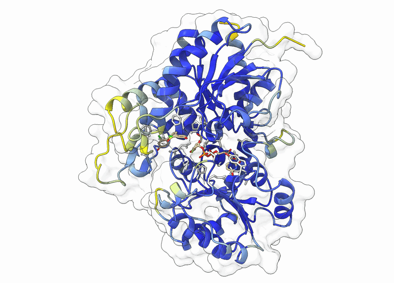
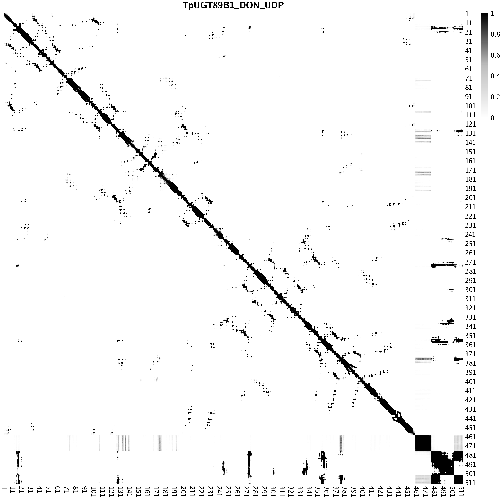
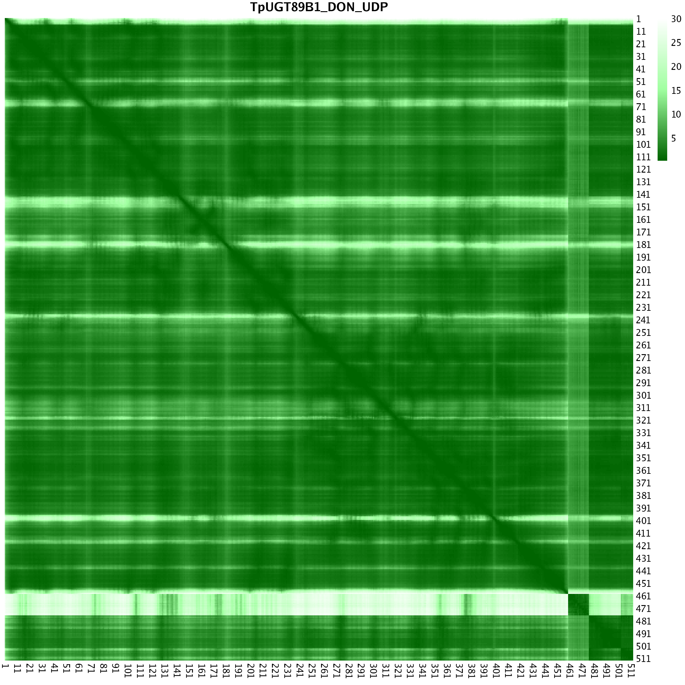
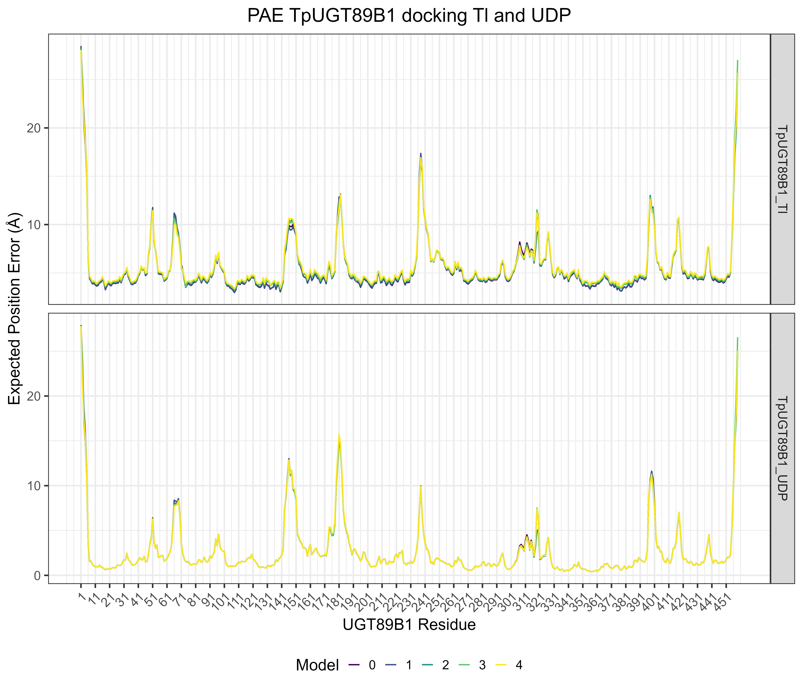
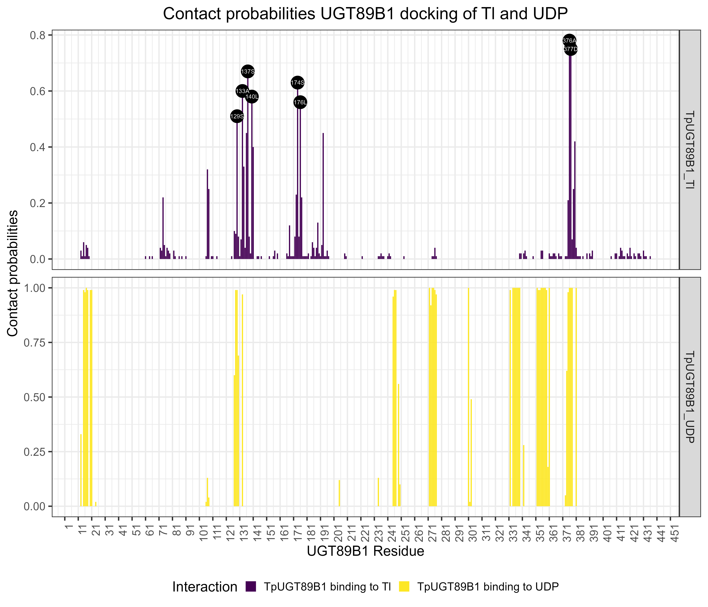

UGT89B1 Docking
================

UDP-glycosyltransferases (UGTs) are versatile plant enzymes that can
detoxify endogenous and exogenous small molecules through glycosylation,
thereby modulating their bioactivity, mobility, and compartmentation.
Structural studies of cereal UGTs involved in trichothecene
detoxification have shown that these enzymes adopt the canonical GT-B
fold, with a conserved donor-binding region for UDP-sugars and a more
variable acceptor pocket that determines substrate selectivity. In
particular, the rice enzyme Os79 was solved in complex with
UDP-2-fluoro-2-deoxy-D-glucose and the trichothecene scaffold
\[[1](#ref-wetterhorn2016crystal)\], providing a structural framework
for how plant UGTs may recognize trichothecene-like fungal metabolites.
Based on this rationale, we complemented the transcriptome-guided
candidate UGT89B1 with Protenix structural modeling and protein-ligand
docking \[[2](#ref-bytedance2025protenix)\] to examine whether the red
clover UGT identified here contains a donor-binding architecture
compatible with UDP-sugar recognition and an acceptor pocket able to
accommodate a [trichothecene-like](https://www.rcsb.org/ligand/7E0)
fungal compound

# Protenix docking

## Json files

The enzyme UGT89B1 sequence used for strucutral modeling

    >TpUGT89B1
    MSIPQTHLIAYPFPTSGHIIPLIDLTKNLITRNINVTVLLTPSNQHLLPPNYSPLLQTLVLPSPQFPNPNQNRLIATITFMHQHHYPIILQWARVHHLPPSAIISDFFLGWTHLLARDLDVPRLVFSPSGAFALSISFSLWRDLPQNDNPDDPNSVVSFPNLPNSPFYPWWQISHLFRDKKVEQDWEMMRTMFLFNLDAWGVVFNSFIDLEPAYFDHIKKELGHERVWAVGPVLPLDSGTEPEERGEASTVSCLELTTWLDKREDRSVVYVCFGSRTFLTTAEMDVLTSALELSGVHFILSVRVPDERRVEEDCGKISSGFIERVRERGFVIQGWASQLVILGHRAVGAFLTHCGWNSVLEGLVSGVVMLTWPMGADQYTNAKLLVDQLGVAVQAAEGDEKIPEINDLVKVIKGSLGRTKERVRAEELRDAALGAIKENGSSQKQLDALVKELNELKND

With the ligands [trichothecene-like](https://www.rcsb.org/ligand/7E0)
(Tl) CCD_7E0 and
[UDP-2-fluoro-2-deoxy-D-glucose](https://www.rcsb.org/ligand/U2F)
CCD_U2F. Using the following commands

``` bash
module load bioinfo-tools biopython/1.80-py3.10.8
python3 -m json.tool  TpUGT89B1_Tl_UDP.json  > TpUGT89B1_Tl_UDP_cor.json
protenix predict --input TpUGT89B1_Tl_UDP_cor.json  --out_dir TpUGT89B1_Tl_UDP_monomer/  --use_msa_server  --seeds 26263

bash inference_parameter.sh TpUGT89B1/TpUGT89B1_Tl_UDP_cor-add-msa.json TpUGT89B1/ 26263 
# In TpUGT89B1_DON_UDP_monomer/seed_26263/predictions flder 
bash Code/ranking.sh
bash Code/rmarkdown_format.sh models_ranking.txt
```

| models  | disorder | iptm | ptm  | plddt | ranking_score | gpde |
|---------|----------|------|------|-------|---------------|------|
| model_0 | 0.00     | 0.93 | 0.96 | 91.34 | 0.93          | 0.49 |
| model_1 | 0.00     | 0.93 | 0.96 | 91.34 | 0.93          | 0.49 |
| model_2 | 0.00     | 0.92 | 0.96 | 91.41 | 0.93          | 0.49 |
| model_3 | 0.00     | 0.92 | 0.96 | 91.34 | 0.93          | 0.49 |
| model_4 | 0.00     | 0.92 | 0.96 | 91.32 | 0.93          | 0.49 |

<div style="text-align: center;">

<figure>

<figcaption style="margin-top: 10px;">

<strong>TpUGT89B1 docking Tl and UDP prediction model 0</strong>

</figcaption>
</figure>

<a name="TpUGT89B1_Tl_UDP.gif"></a>

</div>

## Contact probablities extraction

``` bash
perl Code/extract_pae_pde_contactprob_protenix.pl  TpUGT89B1_Tl_UDP_full_data_sample_0.json  contact_probs TpUGT89B1_Tl_UDP_contact_probs.csv   

for f  in {0..4}; do perl extract_pae_pde_contactprob_protenix.pl TpUGT89B1_Tl_UDP_full_data_sample_"$f".json token_pair_pae TpUGT89B1_Tl_UDP_pae_"$f".csv ; done 

for f  in {0..4}; do perl extract_pae_pde_contactprob_protenix.pl TpUGT89B1_Tl_UDP_full_data_sample_"$f".json token_pair_pde TpUGT89B1_Tl_UDP_pde_"$f".csv ; done 

module load PDCOLD/23.12  R/4.4.0

Rscript Code/contact_prob.R TpUGT89B1_Tl_UDP_contact_probs.csv "TpUGT89B1_DON_UDP"  TpUGT89B1_Tl_UDP_contact_prob.png
Rscript Code/pae_matrix.R TpUGT89B1_Tl_UDP_pae_0.csv "TpUGT89B1_DON_UDP" TpUGT89B1_Tl_UDP_pae_0.png
Rscript Code/pae_matrix.R TpUGT89B1_Tl_UDP_pde_0.csv "TpUGT89B1_DON_UDP" TpUGT89B1_Tl_UDP_pde_0.png
```

### Contact probability

<div style="text-align: center;">

<figure>

<figcaption style="margin-top: 10px;">

<strong>PAE matrix of top model TpUGT89B1 binding Tl and UDP</strong>

</figcaption>
</figure>

<a name="TpUGT89B1_DON_UDP_contact_prob.png"></a>

</div>

### PAE top model

<div style="text-align: center;">

<figure>

<figcaption style="margin-top: 10px;">

<strong>CP matrix of TpUGT89B1 binding Tl and UDP</strong>

</figcaption>
</figure>

<a name="TpUGT89B1_DON_UDP_pae_0.png"></a>

</div>

### Chimera visualization

``` bash
set bgColor white
split #1
show #1 surfaces
color #1.1 #dedddaff
transparency  #1.1 90 s
color bfactor #1.1 ribbon  palette alphafold 
color #1.2 #55ff00 transparency 0
color #1.3 #555500 transparency 0
lighting shadows true
graphics silhouettes true
lighting full
# or alternative 
preset "overall look" "publication 1 (silhouettes)"
select /A:459,1 # Identify the C and N terminal 
save "~/Documents/GitHub/TpUGT89B1_Docking/Figures/TpUGT89B1_Docking.png" supersample 4 width 4000 height 4000
save "~/Documents/GitHub/TpUGT89B1_Docking/Figures/TpUGT89B1_Docking.cxs" 

info residue #1.2 #  Confirm CCD chemical identity 
info atoms #1.2 # Get atom identity for ligands 

info residue #1.3
info atoms #1.3
```

With the last two comands we can get the atom identity of each ligand
modelled, which can be converted into R vector running in a bash
terminal:

``` bash
echo "atom id #1.2/B:1@O01 idatm_type O3
atom id #1.2/B:1@C02 idatm_type Car
atom id #1.2/B:1@C03 idatm_type Car
atom id #1.2/B:1@C04 idatm_type Car
atom id #1.2/B:1@CL05 idatm_type Cl
atom id #1.2/B:1@C06 idatm_type Car
atom id #1.2/B:1@C07 idatm_type Car
atom id #1.2/B:1@C08 idatm_type Car
atom id #1.2/B:1@C09 idatm_type C2
atom id #1.2/B:1@C10 idatm_type C2
atom id #1.2/B:1@C11 idatm_type C2
atom id #1.2/B:1@C12 idatm_type C2
atom id #1.2/B:1@S13 idatm_type Sxd
atom id #1.2/B:1@O14 idatm_type O3-
atom id #1.2/B:1@C15 idatm_type Car
atom id #1.2/B:1@C16 idatm_type Car
atom id #1.2/B:1@CL17 idatm_type Cl
atom id #1.2/B:1@C18 idatm_type Car
atom id #1.2/B:1@C19 idatm_type Car
atom id #1.2/B:1@O20 idatm_type O3
atom id #1.2/B:1@C21 idatm_type Car
atom id #1.2/B:1@C22 idatm_type Car" | awk '{gsub(/.*@/,"",$3);printf $3"\",\""}'
```

TpUGT89B1 has 459 aa, Tl has 17 tokens while UDP 36.

# Interaction surface index analysis

### TpUGT89B1 PAE variation

<!-- 
To identify the number of tokens related to Tl and UDP, evaluate the "token_asym_id" item of file "_full_data_sample_0.json", as shown:
&#10;```bash
echo " "token_asym_id": [0, 0, 0, 0, 0, 0, 0, 0, 0, 0, 0, 0, 0, 0, 0, 0, 0, 0, 0, 0, 0, 0, 0, 0, 0, 0, 0, 0, 0, 0, 0, 0, 0, 0, 0, 0, 0, 0, 0, 0, 0, 0, 0, 0, 0, 0, 0, 0, 0, 0, 0, 0, 0, 0, 0, 0, 0, 0, 0, 0, 0, 0, 0, 0, 0, 0, 0, 0, 0, 0, 0, 0, 0, 0, 0, 0, 0, 0, 0, 0, 0, 0, 0, 0, 0, 0, 0, 0, 0, 0, 0, 0, 0, 0, 0, 0, 0, 0, 0, 0, 0, 0, 0, 0, 0, 0, 0, 0, 0, 0, 0, 0, 0, 0, 0, 0, 0, 0, 0, 0, 0, 0, 0, 0, 0, 0, 0, 0, 0, 0, 0, 0, 0, 0, 0, 0, 0, 0, 0, 0, 0, 0, 0, 0, 0, 0, 0, 0, 0, 0, 0, 0, 0, 0, 0, 0, 0, 0, 0, 0, 0, 0, 0, 0, 0, 0, 0, 0, 0, 0, 0, 0, 0, 0, 0, 0, 0, 0, 0, 0, 0, 0, 0, 0, 0, 0, 0, 0, 0, 0, 0, 0, 0, 0, 0, 0, 0, 0, 0, 0, 0, 0, 0, 0, 0, 0, 0, 0, 0, 0, 0, 0, 0, 0, 0, 0, 0, 0, 0, 0, 0, 0, 0, 0, 0, 0, 0, 0, 0, 0, 0, 0, 0, 0, 0, 0, 0, 0, 0, 0, 0, 0, 0, 0, 0, 0, 0, 0, 0, 0, 0, 0, 0, 0, 0, 0, 0, 0, 0, 0, 0, 0, 0, 0, 0, 0, 0, 0, 0, 0, 0, 0, 0, 0, 0, 0, 0, 0, 0, 0, 0, 0, 0, 0, 0, 0, 0, 0, 0, 0, 0, 0, 0, 0, 0, 0, 0, 0, 0, 0, 0, 0, 0, 0, 0, 0, 0, 0, 0, 0, 0, 0, 0, 0, 0, 0, 0, 0, 0, 0, 0, 0, 0, 0, 0, 0, 0, 0, 0, 0, 0, 0, 0, 0, 0, 0, 0, 0, 0, 0, 0, 0, 0, 0, 0, 0, 0, 0, 0, 0, 0, 0, 0, 0, 0, 0, 0, 0, 0, 0, 0, 0, 0, 0, 0, 0, 0, 0, 0, 0, 0, 0, 0, 0, 0, 0, 0, 0, 0, 0, 0, 0, 0, 0, 0, 0, 0, 0, 0, 0, 0, 0, 0, 0, 0, 0, 0, 0, 0, 0, 0, 0, 0, 0, 0, 0, 0, 0, 0, 0, 0, 0, 0, 0, 0, 0, 0, 0, 0, 0, 0, 0, 0, 0, 0, 0, 0, 0, 0, 0, 0, 0, 0, 0, 0, 0, 0, 0, 0, 0, 0, 0, 0, 0, 0, 0, 0, 0, 0, 0, 0, 0, 0, 0, 0, 0, 0, 0, 0, 1, 1, 1, 1, 1, 1, 1, 1, 1, 1, 1, 1, 1, 1, 1, 1, 1, 1, 1, 1, 1, 1, 2, 2, 2, 2, 2, 2, 2, 2, 2, 2, 2, 2, 2, 2, 2, 2, 2, 2, 2, 2, 2, 2, 2, 2, 2, 2, 2, 2, 2, 2, 2, 2, 2, 2, 2, 2]" | grep -o 1 | wc
```
-->

``` r
TpUGT89B1_seq <-  "MSIPQTHLIAYPFPTSGHIIPLIDLTKNLITRNINVTVLLTPSNQHLLPPNYSPLLQTLVLPSPQFPNPNQNRLIATITFMHQHHYPIILQWARVHHLPPSAIISDFFLGWTHLLARDLDVPRLVFSPSGAFALSISFSLWRDLPQNDNPDDPNSVVSFPNLPNSPFYPWWQISHLFRDKKVEQDWEMMRTMFLFNLDAWGVVFNSFIDLEPAYFDHIKKELGHERVWAVGPVLPLDSGTEPEERGEASTVSCLELTTWLDKREDRSVVYVCFGSRTFLTTAEMDVLTSALELSGVHFILSVRVPDERRVEEDCGKISSGFIERVRERGFVIQGWASQLVILGHRAVGAFLTHCGWNSVLEGLVSGVVMLTWPMGADQYTNAKLLVDQLGVAVQAAEGDEKIPEINDLVKVIKGSLGRTKERVRAEELRDAALGAIKENGSSQKQLDALVKELNELKND" # 459
Tl_seq <- c("C20","C13","C12","C11","C14","C15","O3","C10","C19","C9","C18","C8","C7","C16","C6","C17","O6")  #17 
UDP_seq <- c("C1","O1","PB","O1B","O2B","O3A","PA","O1A","O2A","O5'","C5'","C4'","O4'","C1'","C2'","C3'","O3'","O2'","N1","C6'","O6'","N3","C7'","O7'","C8'","C9'","C2","F1","C3","O3","C4","O4","C5","C6","O6","O5") # 36 
colsplit_TpUGT89B1<- strsplit(TpUGT89B1_seq, "")[[1]]
colsplit_number_TpUGT89B1 <- paste0(seq(1,length(colsplit_TpUGT89B1)), colsplit_TpUGT89B1, sep="")
UDP_number <- paste0(seq(1,length(UDP_seq)), UDP_seq, sep="")

TpUGT89B1_models <- load_model_matrices("TpUGT89B1_Tl_UDP", "pae")

 TpUGT89B1_Tl<- process_pae_models_indexing(TpUGT89B1_models,  460:476, 1:459,"TpUGT89B1 binding to Tl","TpUGT89B1_Tl")
 TpUGT89B1_Tl$MinPAE_Index <-  TpUGT89B1_Tl$MinPAE_Index - 459
TpUGT89B1_Tl$ResidueName <- colsplit_number_TpUGT89B1[TpUGT89B1_Tl$Residue]
TpUGT89B1_Tl$InterName <- Tl_seq[TpUGT89B1_Tl$MinPAE_Index]

 TpUGT89B1_UDP<- process_pae_models_indexing(TpUGT89B1_models, 477:512,  1:459, "TpUGT89B1 binding to UDP","TpUGT89B1_UDP")
  TpUGT89B1_UDP$MinPAE_Index <-  TpUGT89B1_UDP$MinPAE_Index - 476
TpUGT89B1_UDP$ResidueName <- colsplit_number_TpUGT89B1[TpUGT89B1_UDP$Residue]
TpUGT89B1_UDP$InterName <- UDP_seq[TpUGT89B1_UDP$MinPAE_Index]
 
 TpUGT89B1_DF <- rbind.data.frame(TpUGT89B1_Tl,TpUGT89B1_UDP)

TpUGT89B1_DF$Model <- factor(TpUGT89B1_DF$Model, levels = c("0","1","2","3","4")) 

TpUGT89B1_DF_plot <-  ggplot(TpUGT89B1_DF, aes(x = Residue, y = MinPAE ,  colour =Model)) +
  scale_colour_viridis_d()  +   geom_line(size = 0.8, linetype = "solid") +
    labs(title = "PAE TpUGT89B1 docking Tl and UDP",
         x = "UGT89B1 Residue", y = "Expected Position Error (Å)",
         color = "Model") +  theme_bw(base_size = 20)  +
  scale_x_continuous(breaks = seq(1, 459, by = 10)) + 
     theme(axis.text.x = element_text(angle = 45, vjust = 1, hjust=1),plot.title = element_text(hjust = 0.5),legend.position = "bottom") +
  facet_grid(Type~., scales = "free")

  ggsave(filename = "Figures/TpUGT89B1_PAE_plot.pdf", plot = TpUGT89B1_DF_plot,device = "pdf", width=14, height=12)
    ggsave(filename = "Figures/TpUGT89B1_PAE_plot.png", plot = TpUGT89B1_DF_plot,device = "png", width=14, height=12)
```

<div style="text-align: center;">

<figure>

<figcaption style="margin-top: 10px;">

<strong>TpUGT89B1 docking Tl and UDP PAE </strong>

</figcaption>
</figure>

<a name="TpUGT89B1_DF_plot.png"></a>

</div>

# Contact Probability

## TpUGT89B1 CP to Tl and UDP

``` r
  TpUGT89B1_Cp <- as.matrix(read.csv("CP_PAE_PDE/TpUGT89B1_Tl_UDP_contact_probs.csv.gz", header = FALSE))
TpUGT89B1_Cp_Tr <- list(t(TpUGT89B1_Cp))

TpUGT89B1_Cp_Tl <- process_contactP_models_indexing(TpUGT89B1_Cp_Tr,  460:476, 1:459, "TpUGT89B1 binding to Tl","TpUGT89B1_Tl")
 TpUGT89B1_Cp_Tl$MinPAE_Index <-  TpUGT89B1_Cp_Tl$MinPAE_Index - 459
TpUGT89B1_Cp_Tl$ResidueName <- colsplit_number_TpUGT89B1[TpUGT89B1_Cp_Tl$Residue]
TpUGT89B1_Cp_Tl$InterName <- Tl_seq[TpUGT89B1_Cp_Tl$MinPAE_Index]

TpUGT89B1_Cp_UDP <- process_contactP_models_indexing(TpUGT89B1_Cp_Tr, 477:512,  1:459, "TpUGT89B1 binding to UDP","TpUGT89B1_UDP")
 TpUGT89B1_Cp_UDP$MinPAE_Index <-  TpUGT89B1_Cp_UDP$MinPAE_Index - 476
TpUGT89B1_Cp_UDP$ResidueName <- colsplit_number_TpUGT89B1[TpUGT89B1_Cp_UDP$Residue]
TpUGT89B1_Cp_UDP$InterName <- UDP_seq[TpUGT89B1_Cp_UDP$MinPAE_Index]

 TpUGT89B1_CP_DF <- rbind.data.frame(TpUGT89B1_Cp_Tl,TpUGT89B1_Cp_UDP)

highlight_residues <- TpUGT89B1_CP_DF[TpUGT89B1_CP_DF$MinPAE >= 0.9,2]

#TpUGT89B1_CP_DF$ResidueName <- gsub( "[0-9]+", "", TpUGT89B1_CP_DF$ResidueName)

TpUGT89B1_CP_plot <-  ggplot(TpUGT89B1_CP_DF[TpUGT89B1_CP_DF$MinPAE > 0,], aes(x = Residue, y = MinPAE ,  fill =Interaction)) +
  scale_fill_viridis_d() +
 geom_col() + 
  geom_point( data = TpUGT89B1_CP_DF[TpUGT89B1_CP_DF$MinPAE >=0.5 & TpUGT89B1_CP_DF$Type == "TpUGT89B1_Tl",], size = 8, pch = 21, bg = "black", col = 1 ) +
  geom_text( aes(label =ifelse( MinPAE >= 0.5 & Type == "TpUGT89B1_Tl" , ResidueName , NA)), color = "white", size = 3) +
    labs(title = "Contact probabilities UGT89B1 docking of Tl and UDP",
         x = "UGT89B1 Residue", y = "Contact probabilities",
         color = "Interaction") +  theme_bw(base_size = 20)  +
   #geom_text_repel(aes(label =ifelse( MinPAE >= 0.9 , InterName , NA)), segment.size = 0.3) +
  scale_x_continuous(breaks = seq(1, 459, by = 10)) + 
     theme(axis.text.x = element_text(angle = 90, vjust = 1, hjust=1),plot.title = element_text(hjust = 0.5),legend.position = "bottom") + 
  facet_grid(Type~., scales = "free_y") 
  # keep defaults and add highlight_residues as extra breaks
 # scale_x_continuous(breaks = function(x) {
    #unique(c(pretty(x), highlight_residues))
  #})       
  ggsave(filename = "Figures/TpUGT89B1_Cp.pdf", plot = TpUGT89B1_CP_plot,device = "pdf", width=14, height=12)
  ggsave(filename = "Figures/TpUGT89B1_Cp.png", plot = TpUGT89B1_CP_plot,device = "png", width=14, height=12)
  
colnames(TpUGT89B1_CP_DF) <-  c("Interaction",  "Residue","Contact_Probability",  "InteractResidue", "Type",        "Model"    ,    "ResidueName", "InterName") 

 write.csv(TpUGT89B1_CP_DF[TpUGT89B1_CP_DF$Contact_Probability >= 0.1,] , file =  "Results/TpUGT89B1_CP.txt",  row.names =F ) 
```

<div style="text-align: center;">

<figure>

<figcaption style="margin-top: 10px;">

<strong>UGT89B1-Tl-UDP contact probability</strong>

</figcaption>
</figure>

<a name="TpUGT89B1_Cp.png"></a>

</div>

# Computational Domain Annotation

``` r
CP_Short <- TpUGT89B1_CP_DF %>%
  filter(!is.na(Type)) %>%
  transmute(Residue, Type, CP = Contact_Probability)

 Domain_comparative <- ggplot(CP_Short, aes(x = Residue, y = Type, fill = CP)) +
  geom_tile() +
  scale_fill_viridis_c(limits = c(0, 1), name = "Contact probability (CP)") +
  labs(x = "UGT89B1 residue", y = NULL) +
  theme_classic(base_size = 11) +
  theme(
    axis.text.y = element_text(size = 10),
    axis.text.x = element_text(size = 8),
    axis.ticks.y = element_blank()
  )
 
 row_levels <- c("TpUGT89B1_Tl" , "TpUGT89B1_UDP" )
# ---- Row-specific colors (your choices) ----
row_colors <- c(
  "TpUGT89B1_Tl"   = "#003500",
  "TpUGT89B1_UDP"  = "#005770"
)
 
 # ---- Build and stack the 8 strips ----
plots <- lapply(seq_along(row_levels), function(i) {
  rn <- row_levels[i]
  df_row <- CP_Short %>% filter(Type == rn)
  make_strip(df_row, rn, row_colors[[rn]], 
             show_x = (i == length(row_levels)),
            show_title = F, 
            length = 459, 
            label_x = "UGT89B1 residue"
             )
})

p_all <- cowplot::plot_grid(
  plotlist = plots,
  ncol = 1,
  align = "v",
  axis = "l",
  rel_heights = rep(1, length(plots))
)

  ggsave(filename = "Figures/UGT89B1_Domain_Annotation.pdf", plot = p_all,device = "pdf", width=14, height=4)
    ggsave(filename = "Figures/UGT89B1_Domain_Annotation.png", plot = p_all,device = "png", width=14, height=4)
```

# Evolutionary validation

<https://www.ebi.ac.uk/jdispatcher/psa/emboss_needle/summary?jobId=emboss_needle-I20260409-113910-0511-5011325-p1m>
<https://www.rcsb.org/3d-sequence/5TMD?assemblyId=1>
<!-- Tl binding positions of  OsUGT79
22,25,28,80,123,144,190,200,203,293,385
143,144, absent in query, change to 140,150

UDP binding of OsUGT79
29,30,143,144,291,293,345,347,365,370,387--> <!--Tl initial --> python3
aa_equivalence_needle.py OsUGT79_Q7XT97_TbUGT89B.out
22,25,28,80,123,144,190,200,203,293,385 TtoQ <!--Tl  final --> python3
aa_equivalence_needle.py OsUGT79_Q7XT97_TbUGT89B.out
22,24,28,70,85,123,140,190,200,203,293,385 TtoQ

<!--UDP initial -->

python3 aa_equivalence_needle.py OsUGT79_Q7XT97_TbUGT89B.out
29,30,143,144,291,293,345,347,365,370,387 TtoQ

<!--UDP final -->

python3 aa_equivalence_needle.py OsUGT79_Q7XT97_TbUGT89B.out
29,30,155,160,291,293,345,347,365,370,387 TtoQ

# References

<div id="refs" class="references csl-bib-body">

<div id="ref-wetterhorn2016crystal" class="csl-entry">

1\. Wetterhorn KM, Newmister SA, Caniza RK, Busman M, McCormick SP,
Berthiller F, et al. Crystal structure of Os79 (Os04g0206600) from oryza
sativa: A UDP-glucosyltransferase involved in the detoxification of
deoxynivalenol. Biochemistry. 2016;55:6175–86.

</div>

<div id="ref-bytedance2025protenix" class="csl-entry">

2\. Team BAA, Chen X, Zhang Y, Lu C, Ma W, Guan J, et al.
Protenix-advancing structure prediction through a comprehensive
AlphaFold3 reproduction. BioRxiv. 2025;2025–01.

</div>

</div>
